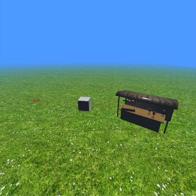
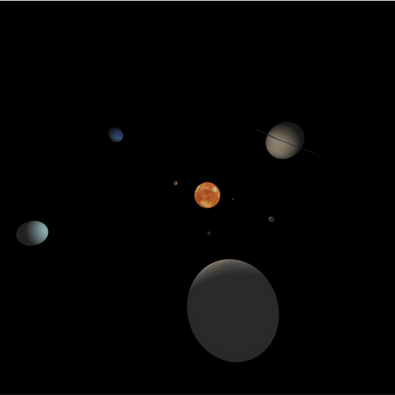
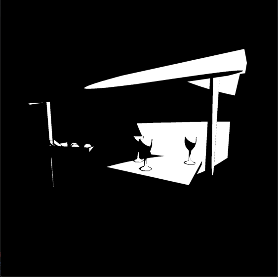

# SMF Game Engine

A low-level game engine built with LWJGL (OpenGL).  
Currently under development and inspired by **[ThinMatrix’s Great Tutorial](https://www.youtube.com/watch?v=VS8wlS9hF8E&list=PLRIWtICgwaX0u7Rf9zkZhLoLuZVfUksDP)**.

---

### 🖼️ Preview

  
  
  
  

---

### 💡 Notes
- The project is still in progress.  
- Expect frequent changes and experimental features.
- Feel free to explore, fork, and adapt it as you wish.
