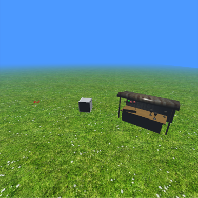
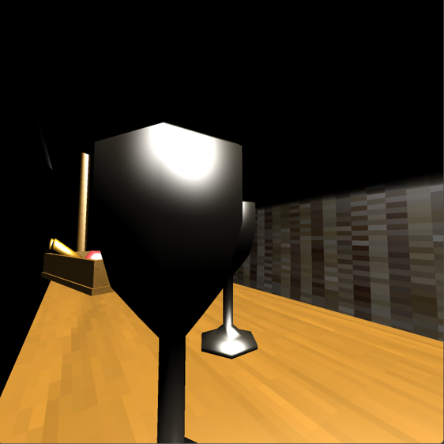
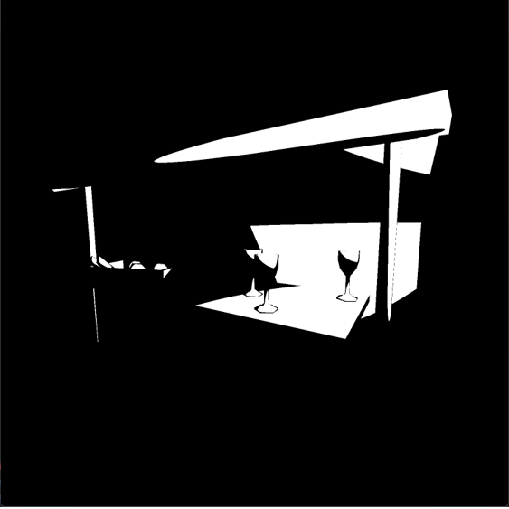

# SMF Game Engine

A low-level game engine built with LWJGL (OpenGL).  
Currently under development and inspired by **[ThinMatrix’s Great Tutorial](https://www.youtube.com/watch?v=VS8wlS9hF8E&list=PLRIWtICgwaX0u7Rf9zkZhLoLuZVfUksDP)**.

---

### 🖼️ Preview

<p>
  
  
  
  
</p>

---

### 💡 Notes
- The project is still in progress.  
- Expect frequent changes and experimental features.
- Feel free to explore, fork, and adapt it as you wish.

### Screenshots and local game debugging

Press **F12** to save the completed game frame (including post-processing/UI) to
`screenshots/`. A JSON sidecar records capture state when debug control is enabled.
PNG files use the framebuffer resolution, exclude the OS window border, and have unique names.
Captures and local session credentials are ignored by Git.

Start a controllable game from this worktree:

```powershell
.\gradlew.bat runGame --args="--debug-control"
.\smf-debug.ps1 status
.\smf-debug.ps1 pause
.\smf-debug.ps1 teleport -Values 44,20,30
.\smf-debug.ps1 look -Values -90,-15
.\smf-debug.ps1 screenshot -Label overview
.\smf-debug.ps1 step -Values 60
.\smf-debug.ps1 screenshot -Label after-one-second
.\smf-debug.ps1 resume
```

`teleport x,y,z` sets the player's **feet** in world coordinates and clears velocity.
`move dx,dy,dz` offsets the feet in world axes; it is a debugging teleport, not collision-tested walking.
`look yaw,pitch` uses degrees: yaw -90 faces -Z; positive pitch looks upward (range -89 to 89).
`pause` freezes simulation and player input but keeps rendering and F12 available.
`step` advances 1–600 fixed updates while paused (60 updates = one simulated second),
and replies after the resulting frame is rendered. Screenshots reply only after PNG/JSON writing succeeds.
Pause before positioning and capturing to keep physics, weather, and camera deterministic.

The opt-in control server accepts only predefined commands on `127.0.0.1`, using
a random port and per-process token from `.smf-debug/<pid>.json`. No server starts
in normal `runGame` or Editor mode. If multiple debug games run in one worktree,
select one with `-GameProcessId <pid>`. The script reads only this worktree's sessions.
Closing the game removes its session file. A stale file after a crash can be ignored.
If scripts are restricted, invoke the checked-in script with a process-local override:
`powershell.exe -NoProfile -ExecutionPolicy Bypass -File .\smf-debug.ps1 status`.
